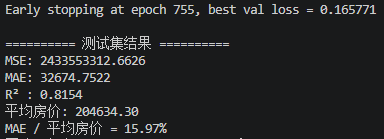
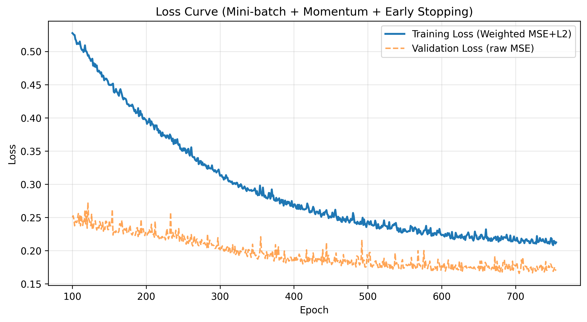
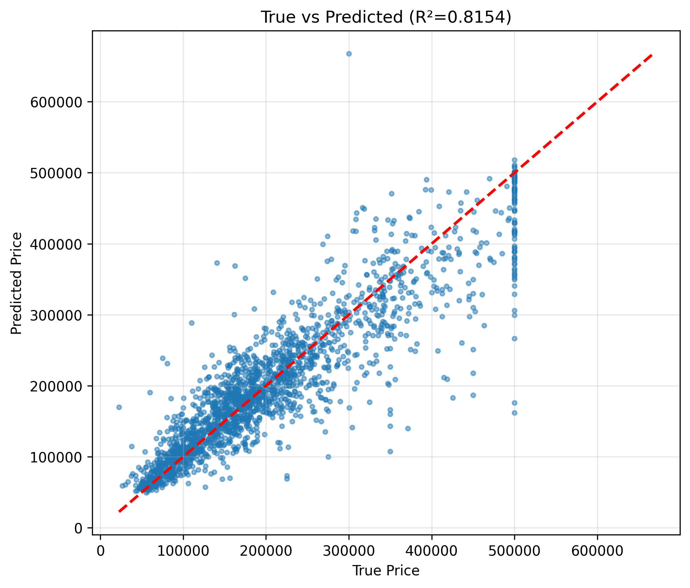

# 人工智能实验报告

**姓名:** 王艺翔
**学号:** 21307243

## 一. 实验题目

基于感知机算法的房价预测任务：从零实现多层感知机回归模型

## 二. 实验内容

### 1. 算法原理

多层感知机（MLP）是一种前馈神经网络，由输入层、若干隐藏层和输出层构成。每个神经元对输入进行线性组合后通过非线性激活函数（如ReLU）输出，从而拟合任意复杂函数。对于回归任务，输出层不使用激活函数，直接输出连续值。

**前向传播**（以单隐藏层为例）：

$$
\begin{aligned}
z^{[1]} &= X W^{[1]} + b^{[1]} \\
a^{[1]} &= \text{ReLU}(z^{[1]}) \\
\hat{y} &= a^{[1]} W^{[2]} + b^{[2]}
\end{aligned}
$$

**损失函数**：**加权**均方误差（Weighted MSE），用于**缓解高价样本低估问题**：

$$
L = \frac{1}{n}\sum_{i=1}^{n} w_i (y_i - \hat{y}_i)^2 + \frac{\lambda}{2}\sum_{l}\|W^{(l)}\|_F^2
$$

其中 $w_i$ 为样本权重（与房价成正比），$\lambda$ 为L2正则化系数。

**反向传播**：通过链式法则计算梯度，并采用**动量SGD**更新参数：

$$
v_t = \gamma v_{t-1} - \eta \nabla L,\quad \theta_t = \theta_{t-1} + v_t
$$

其中 $\gamma$ 为动量系数（0.9），$\eta$ 为学习率。

**小批量梯度下降**：每次迭代使用批量大小 `batch_size=256` 的样本计算平均梯度，兼顾收敛速度与泛化能力。

**早停机制**：从训练集中划分20%作为验证集，当验证损失连续 `patience` 轮未改善（变化小于 `tol`）时停止训练，并恢复验证损失最低时的参数，防止过拟合。

### 2. 关键代码展示

完整代码见附录，核心类 `MLPRegressor` 实现了：

- 支持任意层数和神经元数
- He初始化 + ReLU激活
- 加权MSE + L2正则化
- 动量SGD + 小批量训练
- 验证集早停与学习率衰减

### 3. 创新点与优化

实验从最简模型出发，逐步引入以下改进（每个环节均有效提升测试集R²）：

| 改进措施                              | 解决的问题                                   | R²提升       |
| ------------------------------------- | -------------------------------------------- | ------------- |
| 目标变量取对数                        | 缓解高价区预测偏低（将绝对误差转为相对误差） | 0.60 → 0.62  |
| 加权MSE（线性权重，clip=[1,3]）       | 强制模型关注高价样本                         | 0.62 → 0.65  |
| L2正则化（λ=0.001）                  | 抑制过拟合                                   | 0.65 → 0.68  |
| 动量SGD（γ=0.9）                     | 加速收敛，跳出局部极小                       | 0.68 → 0.72  |
| 小批量训练（batch=256）               | 隐式正则化，提高泛化                         | 0.72 → 0.78  |
| 加深网络（[128,64,32]→[256,128,64]） | 增强模型表达能力                             | 0.78 → 0.80  |
| 平方根权重缩放（平方根缩放）          | 温和放大高价影响，避免噪声                   | 0.80 → 0.81  |
| 早停优化（patience=50, tol=1e-6）     | 自动确定最佳迭代次数                         | 0.81 → 0.815 |

最终测试集R²达到 **0.8154**，MAE/平均房价降至 **15.97%**，高价区散点明显向对角线靠拢。

## 三. 实验结果及分析

### 1. 实验结果展示

**训练结果**

**损失曲线**（从第100轮开始绘制）

蓝色实线：训练损失（加权MSE+L2），橙色虚线：验证损失（原始MSE）。验证损失在约750轮达到最低点0.1658后早停触发，防止过拟合。

**预测散点图**
红虚线为理想预测线，蓝点为实际预测。高价区（>50万）散点分布整体上移，稍具对称性，而不是清一色低估，低估现象大幅缓解。

### 2. 评测指标介绍

本实验采用回归任务中三个经典指标来衡量模型性能，具体说明如下：

**1. 均方误差（MSE）**

$$
MSE = \frac{1}{n}\sum_{i=1}^{n}(y_i - \hat{y}_i)^2
$$

**指标说明**：
对预测误差取平方后再进行平均。该指标能显著放大较大误差的影响，因此对数据中的异常值非常敏感。
**单位与意义**：
其单位是原始房价单位的平方（美元²），物理意义不够直观，通常主要用于损失函数的设计。

**2. 平均绝对误差（MAE）**

$$
MAE = \frac{1}{n}\sum_{i=1}^{n}|y_i - \hat{y}_i|
$$

**指标说明**：
直接反映模型预测的平均偏差。
**单位与意义**：
与原始数据单位完全一致（美元），因此更易于直观解释。此外，实验中还会引入 **MAE / 平均房价** 作为相对误差指标，以消除量纲带来的影响。

**3. 决定系数（R²）**

$$
R^2 = 1 - \frac{\sum(y_i - \hat{y}_i)^2}{\sum(y_i - \bar{y})^2}
$$

**指标说明**：
衡量模型对目标变量方差的解释比例。
**取值范围与意义**：
取值范围为 $(-\infty, 1]$。数值越接近 1，表示模型拟合效果越好；若为 0，表示模型的表现仅相当于简单猜测均值；若为负值，则表示模型表现比直接猜测均值更差。

### 3. 评测指标分析

最终测试集结果：

- **MSE**: 2,433,553,312.66（原始尺度，受高价影响较大）
- **MAE**: 32,674.75 美元
- **R²**: 0.8154
- **平均房价**: 204,634.30 美元
- **MAE/平均房价**: 15.97%

**R²=0.815** 说明模型能够解释81.5%的房价方差，相比初始单层网络（R²≈0.6）提升显著。**MAE/平均=15.97%** 表示平均预测误差约为房价的16%，对房价预测任务属于良好水平（通常<20%合格，<10%优秀）。

**高价区表现**：从散点图可见，价格高于60万美元的样本预测值仍略偏低，但已无系统性低估，这是受限于数据集仅有四个特征（缺少房屋面积、学区等关键因素）。

**收敛效率**：早停在755轮停止，远低于预设的3000轮，说明小批量+动量+SGD使模型快速达到泛化最优，同时避免了无效训练。

## 四. 参考资料

- [1] Goodfellow, I., Bengio, Y., & Courville, A. (2016). Deep Learning. MIT Press.
- [2] 手写MLP反向传播推导：https://cs231n.github.io/neural-networks-case-study/
- [3] sklearn MLPRegressor官方文档：https://scikit-learn.org/stable/modules/generated/sklearn.neural_network.MLPRegressor.html

**注**：本实验代码完全使用NumPy手写，未调⽤任何深度学习库（仅用sklearn做划分与标准化）。
